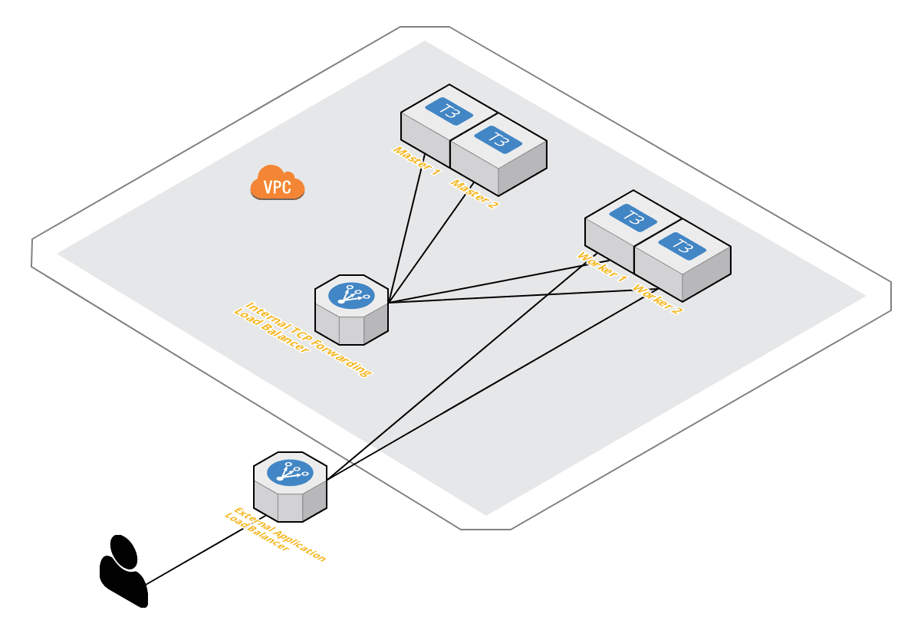

# Bare Metal K8 setup on AWS

## Overview
This guide is about bare metal setup of highly available (HA) Kubernetes cluster on AWS. It is meant only for demo purposes and should not be used in production.

## Software Versions
* Kubernetes - 1.15.3
* Docker - 18.06.1

## Basic Configuration
* Number of control pane nodes - 2
* Number of worker nodes - 2
* Amazon Machine Image for all nodes - Amazon Linux 2 64-bit
* EC2 instance type - t3.medium (2 vCPU, 4GB RAM, 100 GB storage)
* ELB - Application Load Balancer for HA and external access of apps deployed in K8 cluster



## Prerequisite
* Provision the required EC2 instances along with default VPC
* In Security Group of VPC allow all inbound and outbound connections

## Setup
### Network Load Balancer Setup for Kubernetes H8
Reference - [Create a Network Load Balancer](https://docs.aws.amazon.com/elasticloadbalancing/latest/network/create-network-load-balancer.html)
To setup a K8 cluster with HA, a TCP forwarding load balancer is required. This will be used by kube-apiserver for routing requests to both control plane nodes (master nodes).
AWS ELB Network Load Balancer will be used for this purpose. This will be internal to VPC and will not be accessible from external network.

1. In AWS EC2 console create a Load Balancer of type Network Load Balancer.
1. Provide a name and set scheme as internal.
1. Add Listener of type TCP with port 6443.
1. Under Availability Zone choose the VPC created while provisioning EC2 instances.
1. In Configure Security Settings, select the same security group as that being used for EC2 instances.
1. In Configure Routing, add two routes to Master 1 and Master 2 EC2 instances on port 6443.
1. Review and Submit to create the load balancer.


### Hosts File Entry
* In all EC2 instances setup hosts file (/etc/hosts) entry for all EC2 instances and Network Load Balancer
* To get Load Balancer IP, submit a ping request from any EC2 instance to A record of Load Balancer

```@shell
# E.g.,
ping <A record of Load Balancer>
```

### Docker Installation
Docker Version
Execute below commands on all 4 EC2 instances for Docker Installation

```@shell
# Switch to sudo user
sudo -i

# Install Docker
yum install docker

# Configure docker to start on boot
systemctl enable docker

# Start docker service
systemctl start docker

# On successful setup, below command should print docker version without any error message
docker version
```

### K8 Components Installation
Reference - [Install kubeadm](https://kubernetes.io/docs/setup/production-environment/tools/kubeadm/install-kubeadm/)
On all 4 EC2 instances, install K8 components (kubectl, kubeadm, kubelet) using below commands:

```@shell
# Configure K8 yum repository
cat <<EOF > /etc/yum.repos.d/kubernetes.repo
[kubernetes]
name=Kubernetes
baseurl=https://packages.cloud.google.com/yum/repos/kubernetes-el7-x86_64
enabled=1
gpgcheck=1
repo_gpgcheck=1
gpgkey=https://packages.cloud.google.com/yum/doc/yum-key.gpg https://packages.cloud.google.com/yum/doc/rpm-package-key.gpg
EOF

# Set SELinux in permissive mode (effectively disabling it)
setenforce 0
sed -i 's/^SELINUX=enforcing$/SELINUX=permissive/' /etc/selinux/config

# Install kube components
yum install -y kubelet kubeadm kubectl --disableexcludes=kubernetes

# If above command results in error, then set repo_gpgcheck=0 in /etc/yum.repos.d/kubernetes.repo

# Configure kubelet to start on boot
systemctl enable --now kubelet

# Start kubelet service
systemctl start kubelet

# Pre-pull images required for K8 setup
kubeadm config images pull
```


### Setup Kubernetes Cluster
Reference - [Creating Highly Available clusters with kubeadm](https://kubernetes.io/docs/setup/production-environment/tools/kubeadm/high-availability/)
#### Steps for the first control plane node
1. On the first control plane node, create a configuration file called kubeadm-config.yaml with below contents. controlPlaneEndpoint should match the address or DNS and port of the load balancer.
    ```@yaml
    apiVersion: kubeadm.k8s.io/v1beta2
    kind: ClusterConfiguration
    kubernetesVersion: stable
    controlPlaneEndpoint: "LOAD_BALANCER_DNS:LOAD_BALANCER_PORT"
    ```

1. Initialize the control plane:
   ```@shell
   sudo kubeadm init --config=kubeadm-config.yaml --upload-certs
   ```

1. After the command completes you should see something like below. Copy it to a text file.
   ```@shell
   ...
   You can now join any number of control-plane node by running the following command on each as a root:
   kubeadm join 192.168.0.200:6443 --token 9vr73a.a8uxyaju799qwdjv --discovery-token-ca-cert-hash sha256:7c2e69131a36ae2a042a339b33381c6d0d43887e2de83720eff5359e26aec866 --control-plane --certificate-key f8902e114ef118304e561c3ecd4d0b543adc226b7a07f675f56564185ffe0c07

   Please note that the certificate-key gives access to cluster sensitive data, keep it secret!
   As a safeguard, uploaded-certs will be deleted in two hours; If necessary, you can use kubeadm init phase upload-certs to reload certs afterward.

   Then you can join any number of worker nodes by running the following on each as root:
   kubeadm join 192.168.0.200:6443 --token 9vr73a.a8uxyaju799qwdjv --discovery-token-ca-cert-hash sha256:7c2e69131a36ae2a042a339b33381c6d0d43887e2de83720eff5359e26aec866

1. Apply CNI of type Weave Net:
   ```@shell
   kubectl apply -f "https://cloud.weave.works/k8s/net?k8s-version=$(kubectl version | base64 | tr -d '\n')"
   ```

#### Steps for the second control plane node
1. Copy below list of certificates from first control node to the second node in the same destination directory:
   * /etc/kubernetes/pki/ca.crt
   * /etc/kubernetes/pki/ca.key
   * /etc/kubernetes/pki/sa.key
   * /etc/kubernetes/pki/sa.pub
   * /etc/kubernetes/pki/front-proxy-ca.crt
   * /etc/kubernetes/pki/front-proxy-ca.key
   * /etc/kubernetes/pki/etcd/ca.crt
   * /etc/kubernetes/pki/etcd/ca.key

2. Execute the join command that was previously given to you by the kubeadm init output on the first node. It should look something like this:
   ```@shell
   sudo kubeadm join 192.168.0.200:6443 --token 9vr73a.a8uxyaju799qwdjv --discovery-token-ca-cert-hash sha256:7c2e69131a36ae2a042a339b33381c6d0d43887e2de83720eff5359e26aec866 --control-plane --certificate-key f8902e114ef118304e561c3ecd4d0b543adc226b7a07f675f56564185ffe0c07
   ```

#### Join Worker Nodes
Worker nodes can be joined to the cluster with the command you stored previously as the output from the kubeadm init command:
```@shell
sudo kubeadm join 192.168.0.200:6443 --token 9vr73a.a8uxyaju799qwdjv --discovery-token-ca-cert-hash sha256:7c2e69131a36ae2a042a339b33381c6d0d43887e2de83720eff5359e26aec866
```

#### Check Node Status
After joining control pane and worker nodes, execute below command on primary control node to see the status of all nodes
```@shell
kubectl get nodes
```
